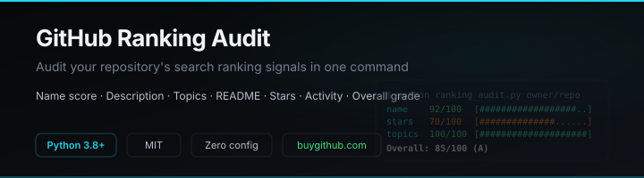

<p align="center">
  
</p>

<p align="center">
  <a href="https://buygithub.com/?utm_source=github&utm_medium=readme&utm_campaign=github-ranking-audit">
    
  </a>
</p>

<p align="center">
  <a href="https://github.com/nMaas8388/github-ranking-audit/stargazers"></a>
  <a href="https://github.com/nMaas8388/github-ranking-audit/blob/main/LICENSE"></a>
  <a href="https://www.python.org/"></a>
</p>

<p align="center">
  Audit your GitHub repository's search ranking signals.<br>
  Checks name, description, topics, README, stars, and activity. Scores each factor 0-100.
</p>

<p align="center">
  <a href="https://buygithub.com/?utm_source=github&utm_medium=readme&utm_campaign=github-ranking-audit"><b>buygithub.com</b></a> · <a href="https://buygithub.com/blog/github-seo-rank-repository/?utm_source=github&utm_medium=readme&utm_campaign=github-ranking-audit">How GitHub SEO Works</a>
</p>

---

## What it does

Pass any GitHub repository and get a search ranking audit. The tool checks six signals that affect where your repo appears in GitHub search results, scores each one, and gives you an overall grade with actionable tips.

**Signals checked:**
- **Name** — does it contain the keywords people search for?
- **Description** — is it complete and under 300 characters?
- **Topics** — how many, and are they relevant?
- **README** — word count and keyword presence in the first 200 words
- **Stars** — competitive positioning
- **Activity** — last push date (repos updated in the last 90 days rank higher)

## Quick start

```bash
git clone https://github.com/nMaas8388/github-ranking-audit.git
cd github-ranking-audit
pip install requests
python ranking_audit.py facebook/react
```

## Usage

### Audit a single repository

```bash
python ranking_audit.py torvalds/linux
```

```
Auditing torvalds/linux...

  Repository:   torvalds/linux
  Description:  Linux kernel source tree
  Language:     C
  Stars:        183,247
  Forks:        54,102
  Topics:       3 (linux, kernel, c)
  Last push:    2026-09-16
  README words: 847

  Scores:
    name            75/100  [###############.....]
    description     60/100  [############........]
    topics          40/100  [########............]
    readme         100/100  [####################]
    stars          100/100  [####################]
    activity       100/100  [####################]

  Overall: 82/100 (Grade B)

  Tip: add 8-15 relevant topics to improve discoverability
```

### Audit with a target search query

```bash
python ranking_audit.py owner/repo --query "cloudflare turnstile solver"
```

### Audit multiple repos

```bash
python ranking_audit.py facebook/react vuejs/vue sveltejs/svelte
```

### JSON output

```bash
python ranking_audit.py owner/repo --json
```

## Scoring

| Signal | Weight | What it checks |
|--------|--------|---------------|
| Name | 25% | Query keyword match |
| Description | 15% | Length and completeness |
| Topics | 15% | Count (8-15 is optimal) |
| README | 15% | Word count, first 200 words |
| Stars | 20% | Logarithmic scale |
| Activity | 10% | Days since last push |

Grades: A (85+), B (70-84), C (50-69), D (30-49), F (<30)

## How GitHub search ranking works

GitHub's "Best match" sort combines text relevance (name > description > topics > README) with popularity signals (stars > forks > watchers > recent activity). The exact weights aren't published, but the ranking order is well-documented by the community.

Read the full analysis: [How GitHub SEO Works](https://buygithub.com/blog/github-seo-rank-repository/?utm_source=github&utm_medium=readme&utm_campaign=github-ranking-audit)

## Requirements

- Python 3.8+
- `requests`
- Optional: `GITHUB_TOKEN` env var for higher API rate limits

## License

MIT
